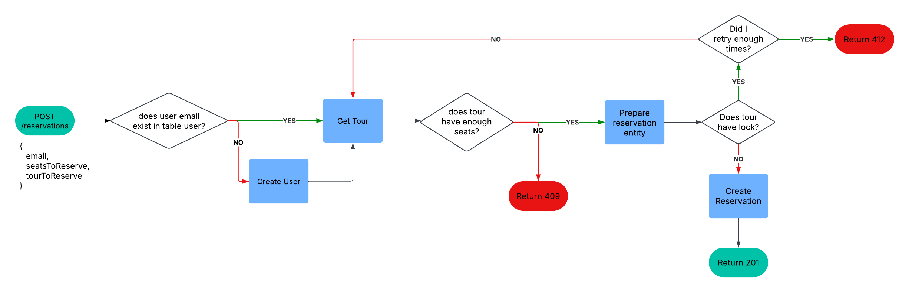

Here’s an improved version of your ADR with more clarity, structure, and detail:

---

# ADR 005: Handling Reservation Conflicts for Booking System

## Context

To ensure a seamless booking experience for customers and prevent overbooking, the system needs an efficient algorithm to manage tour reservations. The goal is to guarantee that a tour’s capacity is never exceeded, ensuring no conflicts between reservations.

The system must handle concurrent booking attempts, especially during peak times, while maintaining data integrity. A robust conflict resolution strategy is critical to prevent errors in availability and improve customer satisfaction.

## Decision

We have decided to implement an algorithm designed to prevent overbooking and ensure tour availability is accurately reflected at all times. The flowchart below outlines the algorithm:

## Rationale

This approach was chosen due to:

- Its simplicity and efficiency in preventing overbooking.
- Ensuring system stability even under high concurrent booking loads.
- Its compatibility with the existing system architecture, as described in [ADR 003: Database Schema](0003-database-schema.md).

## Consequences

- The system will require additional resources for handling concurrent reservations, which may impact performance in high-traffic scenarios.
- A potential for slight delays in reservations confirmations due to the additional check for availability during each booking process.
